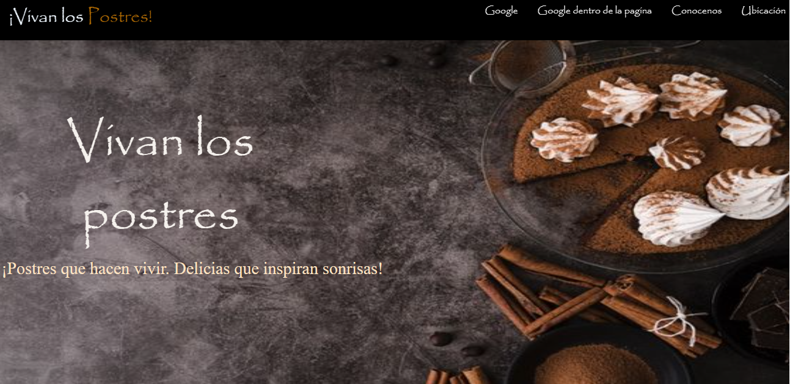
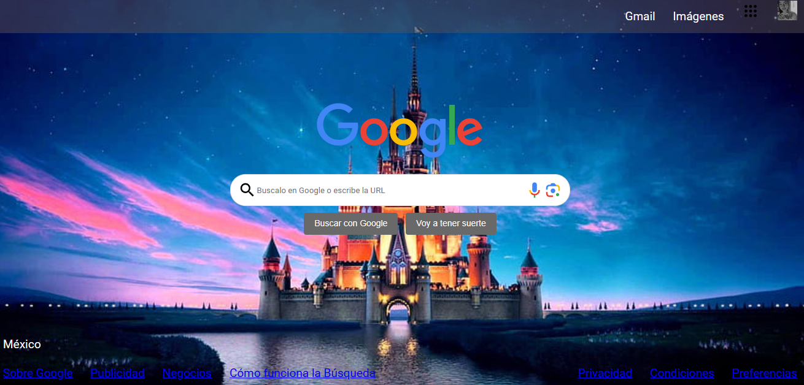
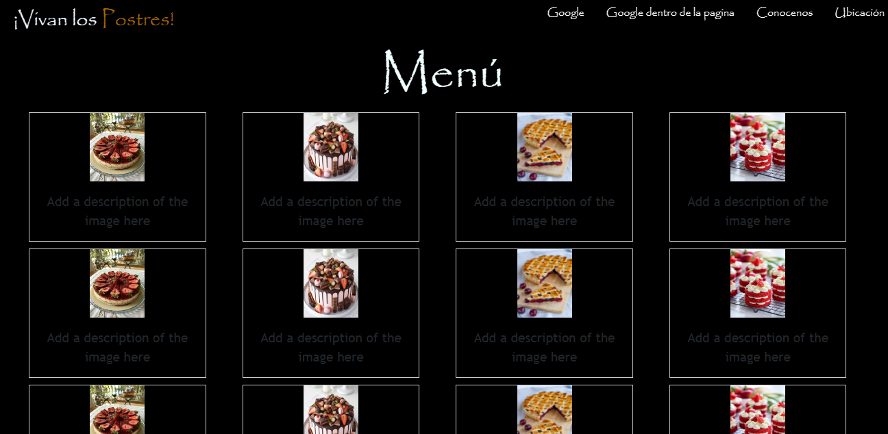

# Mi portafolio de Tecnolochicas PRO

Este portafolio es desarrollado para poner en práctica las habilidades desarrolladas dentro del bootcamp de desarrollo frontend.

Fue desarrollada con HTML, CSS y JS con el uso de framework Bootstrap utilizando animaciones de bibliotecas externas.

[Proyecto en línea](https://lustrous-torrone-f3baba.netlify.app/)

- Capturas de pantalla 

-Tecnologías

* HTML
* CSS
* Javascript
* Bootstrap 5

Ocupamos bibliotecas extra.

Creado por Jatziry en el bootcamp de Tecnolochicas PRO.

